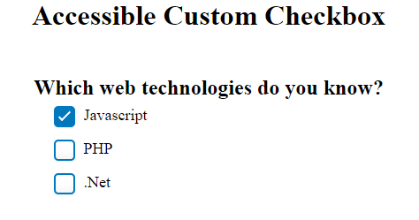

# Accessible Checkboxes
## Introduction
A custom checkbox is a GUI widget that permits the user to make choices between two or more possible options. Instead of using native elements, it is coded using div element and ARIA roles, attributes  and  CSS to offer design customization for web page authors.

## Keyboard Support

|  Key |  Function |
|---|---|
|  Tab or Down Arrow  |  Navigates to the next checkbox |
|  Shift + Tab or Up Arrow  |  Navigates to the previous checkbox |
|  Spacebar |  Toggles state of the checkboxes, i.e.  checked and unchecked. |

## ARIA Roles and attributes 

| Attributes   | Description   |
|---|---|
| Role group   |  Identifies the div element as a group container for the checkboxes |
| aria-labelledby  |  Points to the id of the heading to specify accessible name for the group. |
| Role checkbox   |  Identifies the div element as a checkbox. |
|  aria-checked |  Set to true when the checkbox is checked and set to false when the checkbox is not checked. |
| Tabindex 0  |  Set it on the 
 element with role checkbox to make sure it receives keyboard focus. |

## Browser and Screen reader Support

| Operating System | Browser  | Screen Reader  | Compatible  |
|---|---|---|---|
|  Windows |  Chrome | JAWS  | Yes  |
|  Windows | Edge  |  JAWS | Yes  |
|  Windows | Firefox  | NVDA  | Yes  |
|  Windows |  IE 11 |  JAWS |  Yes |
| Mac  |  Safari |  Voiceover | Yes  |
|  IOS |  Safari | Voiceover  | Yes  |
|  Android |Chrome   | Talkback  | Yes  |
